# 🧠 Akka SDK - AI Agent Demo

This project demonstrates how to build a chat agent using the
[AI Agent component](https://doc.akka.io/java/agents.html) of the
[Akka SDK](https://doc.akka.io/).

We use OpenAI as the LLM provider.

The following components are used:

- `HttpEndpoint` to serve the UI and to process http requests.
- `Agent` with a system message to set the context for the prompt.
  + Durable storage session based on the username.
  + Streaming interaction with the LLM.

<p align="center">
  
</p>

# 🚀 Getting Started

### Requirements

- Java 21
- [Maven]
- **[Docker Desktop] 4.43.0+ or [Docker Engine]** installed.
- **A laptop or workstation** (e.g., a MacBook).
- If you're using Docker Engine on Linux, ensure you have [Docker Compose] 2.38.1 or later installed.
- An [OpenAI API Key](https://platform.openai.com/api-keys) 🔑.

### Run the project

Create a `secret.openai-api-key` file with your OpenAI API key:

```plaintext
sk-...
```

Then run:

```sh
make build-and-run
```

Alternatively, you can run:

```sh
export OPENAI_API_KEY=
mvn clean install -DskipTests -Pstandalone
docker compose up
```

Everything runs from the container. Open `http://localhost:9000` in your browser to start to interact with the agent.

# 📚 More

This demo was created as part of a [webinar we did](https://akka.io/blog/webinar-creating-certainty-in-the-age-of-agentic-ai).

Feel free to take a look if you want to go further. The app was:

- Created using vibe coding using Claude Desktop.
- Exposing MCP endpoints.
- Run locally with multiple instances forming a resilient cluster.

To learn more, please visit our
[getting started docs](https://doc.akka.io/getting-started/index.html)
or check out [additional samples](https://github.com/akka-samples).

# 🧹 Cleanup

To stop and remove containers and volumes:

```sh
docker compose down -v
```

# 🔧 Architecture Overview

```mermaid
flowchart TD
subgraph Browser
localhost:9000
end

    subgraph Akka SDK
      HttpUi[🖥️ UI]
      HttpAgent[🎯 Agent http api]
      Agent[🧠 Agent: session memory]      
    end

    subgraph Open AI      
      LLM[(gpt-4o-mini)]
    end

    Browser -->|Http| HttpUi
    Browser -->|Http| HttpAgent
    HttpAgent -->|Akka ComponentClient| Agent
    Agent -->|Streaming| LLM
```



📎 Credits

- [Akka SDK Team]
- [Akks SDK samples](https://github.com/akka-samples)
- [Docker Compose]

[Maven]: http://maven.apache.org/
[Akka SDK Team]: https://docs.akka.io/
[Docker Compose]: https://github.com/docker/compose
[Docker Desktop]: https://www.docker.com/products/docker-desktop/
[Docker Engine]: https://docs.docker.com/engine/
